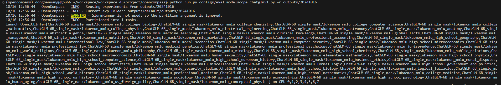

- [ ] docker打镜像，测试bailing65b编译1层没问题，把moffett_software 和 moffett_software_source 拷贝出来上传aliyun
    1. docker打镜像
    ```
    export COMMIT_TIME=$(git show -s --format=%ci $CI_COMMIT_SHA |awk '{print $1"-"$2}' |tr -cd [:digit:] )
    docker build --no-cache -t sparse_llm-20241016-$(arch):$COMMIT_TIME .
    ```
    2. 镜像拷贝到105测试bailing65b编译
     - 1、启动容器
    ```
    docker run -it --rm --shm-size 256g --net=host --publish-all --privileged --cap-add=ALL  -v /dev:/dev -v /usr/src:/usr/src -v /lib/modules:/lib/modules  -v /mnt/moffett/workspace/ant/auto_compile:/home/moffett/workspace/llm_compile/data 36ce458d95a6
    docker exec -it beab78904e3e /bin/bash
    ```
     - 2. 镜像里测试编译，只编译两层
        ```
        # 105
        python3 /home/moffett/workspace/llm_compile/data/compile_llm_from_hf_v2.py -o ../llm_compile/data/20241016_bailing_10B_layer2_new_1111 -wo /home/moffett/workspace/llm_compile/data/bailing_10B/ -hfmn /home/moffett/workspace/llm_compile/data/bailing_10B/ -cm tp serving -cfg /home/moffett/workspace/llm_compile/data/bailing_10B/bailing10b_tp_serving.json
        ```

        容器中编译报错：
        1、


        2、IndexError: list index out of range
        ```
        """
            Traceback (most recent call last):
            File "/usr/lib/python3.8/multiprocessing/pool.py", line 125, in worker
                result = (True, func(*args, **kwds))
            File "/usr/lib/python3.8/multiprocessing/pool.py", line 51, in starmapstar
                return list(itertools.starmap(args[0], args[1]))
            File "sparse_compile/gpt/llm_compiler.py", line 217, in gpt.llm_compiler.LLMCompiler.per_module_build
            File "sparse_compile/gpt/general_llm_tools/op_base.py", line 241, in general_llm_tools.op_base.OpModuleBase.create_network
            File "sparse_compile/gpt/general_llm_tools/kv_cache.py", line 75, in general_llm_tools.kv_cache.KVCacheBase.relay_expr
            IndexError: list index out of range
            """

            The above exception was the direct cause of the following exception:

            Traceback (most recent call last):
            File "/home/moffett/workspace/llm_compile/data/compile_llm_from_hf_v2.py", line 101, in <module>
                moffett_llm_engine.compile()
            File "sparse_compile/gpt/moffett_llm_engine.py", line 183, in gpt.moffett_llm_engine.MoffettLLMEngine.compile
            File "sparse_compile/gpt/llm_compiler.py", line 163, in gpt.llm_compiler.LLMCompiler.compile
            File "sparse_compile/gpt/llm_compiler.py", line 164, in gpt.llm_compiler.LLMCompiler.compile
            File "/usr/lib/python3.8/multiprocessing/pool.py", line 372, in starmap
                return self._map_async(func, iterable, starmapstar, chunksize).get()
            File "/usr/lib/python3.8/multiprocessing/pool.py", line 771, in get
                raise self._value
            IndexError: list index out of range
        ```


    3. 容器拷贝到本地上传aliyun


    
- [ ] opencompass 评测 chatglmv1
1. 增加评测config


2. 遇到bug
    - 1、transformer版本不兼容，太高了
```
报错信息：
AttributeError: 'ChatGLMTokenizer' object has no attribute 'sp_tokenizer'. Did you mean: '_tokenize'?
解决方法：
pip install -i transformers==4.27 https://pypi.tuna.tsinghua.edu.cn/simple
```

    - 2、ValueError: Unrecognized configuration class <class 'transformers_modules.ChatGLM-6B.configuration_chatglm.ChatGLMConfig'> for this kind of AutoModel: AutoModelForCausalLM.
```
config.json 
"AutoModel": "modeling_chatglm.ChatGLMForConditionalGeneration",
修改为
"AutoModelForCausalLM": "modeling_chatglm.ChatGLMForConditionalGeneration",
参考：https://github.com/THUDM/ChatGLM-6B/issues/37
```

3.  运行成功结果
    - 1、运行结果

    - 2、运行结果查看


ChatGLM-6B_single_mask/lukaemon_mmlu_college_biology,
ChatGLM-6B_single_mask/lukaemon_mmlu_college_chemistry,
ChatGLM-6B_single_mask/lukaemon_mmlu_college_computer_science,
ChatGLM-6B_single_mask/lukaemon_mmlu_college_mathematics,
ChatGLM-6B_single_mask/lukaemon_mmlu_college_physics,
ChatGLM-6B_single_mask/lukaemon_mmlu_electrical_engineering,
ChatGLM-6B_single_mask/lukaemon_mmlu_astronomy,
ChatGLM-6B_single_mask/lukaemon_mmlu_anatomy,
ChatGLM-6B_single_mask/lukaemon_mmlu_abstract_algebra,
ChatGLM-6B_single_mask/lukaemon_mmlu_machine_learning,
ChatGLM-6B_single_mask/lukaemon_mmlu_clinical_knowledge,
ChatGLM-6B_single_mask/lukaemon_mmlu_global_facts,
ChatGLM-6B_single_mask/lukaemon_mmlu_management,
ChatGLM-6B_single_mask/lukaemon_mmlu_nutrition,
ChatGLM-6B_single_mask/lukaemon_mmlu_marketing,
ChatGLM-6B_single_mask/lukaemon_mmlu_professional_accounting,
ChatGLM-6B_single_mask/lukaemon_mmlu_high_school_geography
,ChatGLM-6B_single_mask/lukaemon_mmlu_international_law,
ChatGLM-6B_single_mask/lukaemon_mmlu_moral_scenarios,
ChatGLM-6B_single_mask/lukaemon_mmlu_computer_security,
ChatGLM-6B_single_mask/lukaemon_mmlu_high_school_microeconomics,
ChatGLM-6B_single_mask/lukaemon_mmlu_professional_law,
ChatGLM-6B_single_mask/lukaemon_mmlu_medical_genetics,
ChatGLM-6B_single_mask/lukaemon_mmlu_professional_psychology,
ChatGLM-6B_single_mask/lukaemon_mmlu_jurisprudence,
ChatGLM-6B_single_mask/lukaemon_mmlu_world_religions,
ChatGLM-6B_single_mask/lukaemon_mmlu_philosophy,
ChatGLM-6B_single_mask/lukaemon_mmlu_virology,
ChatGLM-6B_single_mask/lukaemon_mmlu_high_school_chemistry,
ChatGLM-6B_single_mask/lukaemon_mmlu_public_relations,
ChatGLM-6B_single_mask/lukaemon_mmlu_high_school_macroeconomics,
ChatGLM-6B_single_mask/lukaemon_mmlu_human_sexuality,
ChatGLM-6B_single_mask/lukaemon_mmlu_elementary_mathematics,
ChatGLM-6B_single_mask/lukaemon_mmlu_high_school_physics,
ChatGLM-6B_single_mask/lukaemon_mmlu_high_school_computer_science,
ChatGLM-6B_single_mask/lukaemon_mmlu_high_school_european_history,
ChatGLM-6B_single_mask/lukaemon_mmlu_business_ethics,
ChatGLM-6B_single_mask/lukaemon_mmlu_moral_disputes,
ChatGLM-6B_single_mask/lukaemon_mmlu_high_school_statistics,
ChatGLM-6B_single_mask/lukaemon_mmlu_miscellaneous,
ChatGLM-6B_single_mask/lukaemon_mmlu_formal_logic,
ChatGLM-6B_single_mask/lukaemon_mmlu_high_school_government_and_politics,
ChatGLM-6B_single_mask/lukaemon_mmlu_prehistory,
ChatGLM-6B_single_mask/lukaemon_mmlu_security_studies,
ChatGLM-6B_single_mask/lukaemon_mmlu_high_school_biology,
ChatGLM-6B_single_mask/lukaemon_mmlu_logical_fallacies,
ChatGLM-6B_single_mask/lukaemon_mmlu_high_school_world_history,
ChatGLM-6B_single_mask/lukaemon_mmlu_professional_medicine,
ChatGLM-6B_single_mask/lukaemon_mmlu_high_school_mathematics,
ChatGLM-6B_single_mask/lukaemon_mmlu_college_medicine,
ChatGLM-6B_single_mask/lukaemon_mmlu_high_school_us_history,
ChatGLM-6B_single_mask/lukaemon_mmlu_sociology,
ChatGLM-6B_single_mask/lukaemon_mmlu_econometrics,
ChatGLM-6B_single_mask/lukaemon_mmlu_high_school_psychology,
ChatGLM-6B_single_mask/lukaemon_mmlu_human_aging,
ChatGLM-6B_single_mask/lukaemon_mmlu_us_foreign_policy,
ChatGLM-6B_single_mask/lukaemon_mmlu_conceptual_physics