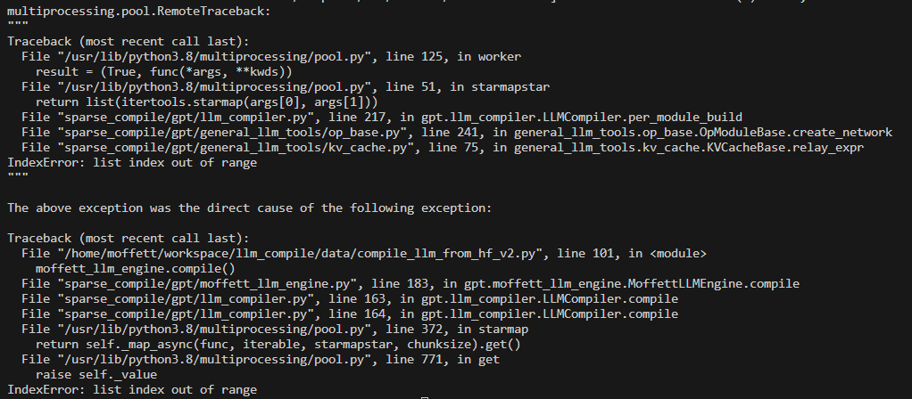

- [ ] 支持q，k,v，拆分分数和core_attention没有倍数关系，可以随意拆分，新代码docker测试打包
    1. docker 编译测试
    ```

    # 启动容器
    10.1.100.66
docker run -it --rm --shm-size 256g --net=host --publish-all --privileged --cap-add=ALL  -v /dev:/dev -v /usr/src:/usr/src -v /lib/modules:/lib/modules  -v /ssd2/dongbenyang:/home/moffett/workspace/llm_compile/data 8fab6957521d
    docker exec -it beab78904e3e /bin/bash

    python3 /home/moffett/workspace/llm_compile/data/compile_llm_from_hf_v2.py -o /home/moffett/workspace/llm_compile/data/case/llm_compile/data/case/20241016_bailing_10B_layer2_new_xxxx -wo /home/moffett/workspace/llm_compile/data/bailing_10B/ -hfmn /home/moffett/workspace/llm_compile/data/bailing_10B/ -cm tp serving -cfg /home/moffett/workspace/llm_compile/data/bailing_10B/bailing10b_tp_serving.json


    105
    docker run -it --rm --shm-size 256g --net=host --publish-all --privileged --cap-add=ALL  -v /dev:/dev -v /usr/src:/usr/src -v /lib/modules:/lib/modules  -v /mnt/moffett/workspace/ant/auto_compile:/home/moffett/workspace/llm_compile/data 36ce458d95a6
    docker exec -it beab78904e3e /bin/bash

    
    # 编译测试
    python3 /home/moffett/workspace/llm_compile/data/compile_llm_from_hf_v2.py -o ../llm_compile/data/20241016_bailing_10B_layer2_new_xxxx -wo /home/moffett/workspace/llm_compile/data/bailing_10B/ -hfmn /home/moffett/workspace/llm_compile/data/bailing_10B/ -cm tp serving -cfg /home/moffett/workspace/llm_compile/data/bailing_10B/bailing10b_tp_serving.json
    ```
    2. 上传aliyun
    ossutil64 cp /ssd6/dongbenyang/sparse_llm/moffett_software.tar.gz oss://moffett-oss-bucket01/Ali/antgroup/moffett_llm/
    ossutil64 cp /ssd6/dongbenyang/sparse_llm/moffett_software_source.tar.gz oss://moffett-oss-bucket01/Ali/antgroup/moffett_llm/

    # 查看文件
    ossutil64 ls oss://moffett-oss-bucket01/Ali/antgroup/moffett_llm/

    # 删除文件
    ossutil64 rm oss://moffett-oss-bucket01/CompilerTeam/filename

    bug:
        1. AttributeError
        
        修改：

    3. IndexError: list index out of range
        修改：

        


-[ ] opencompass 文档补充完，执行流程画图