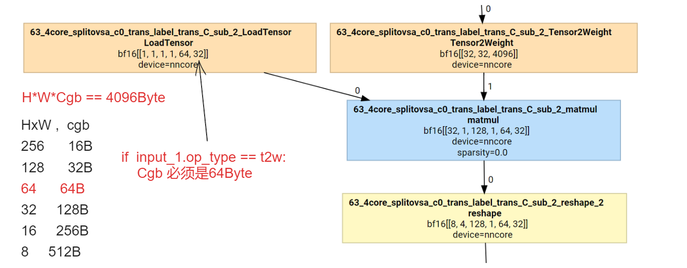

- [x] 1、llama3_70b 编译测试性能  - > 18号的任务

- [x] 2、opencompass 评估 chaglm-6b
    数据集：gms8k

- [ ] 3、qwen2.5_7b 最大句长尝试调大编译
    - [x] max_seq_len:6k
    - [x] max_seq_len:4k, core_attention右分支rehsape 24M，大于glm 16M，放不下

编译命令：
```
# 1、max_seq_len:6144
python sparse_compile/example/compile_llm_from_hf_v2.py -o /home/dongbenyang/workspace/moffett_software/debug/debug6/case/20241021_sparse_llm_qwen2.5_7B_max_seq_len_6k_layer2  -wo /ssd4/dongbenyang/Qwen2.5-7B -hfmn Qwen/Qwen2.5-7B-Instruct -cm tp serving -cfg /home/dongbenyang/workspace/git_lab/moffett_software/debug/qwen2.5_7b_sparsert_llm_performance_config_max_seq_len_6k.json

# 2、max_seq_len:4096
python sparse_compile/example/compile_llm_from_hf_v2.py -o /home/dongbenyang/workspace/moffett_software/debug/debug6/case/20241021_sparse_llm_qwen2.5_7B_max_seq_len_4k_layer1  -wo /ssd4/dongbenyang/Qwen2.5-7B -hfmn Qwen/Qwen2.5-7B-Instruct -cm tp serving -cfg /home/dongbenyang/workspace/git_lab/moffett_software/debug/qwen2.5_7b_sparsert_llm_performance_config_max_seq_len_4k.json
```

- [ ] 4、llama3_8b:
    - [x] max_seq_len:4k
    - [x] max_seq_len:6k

成功的配置：
```
{
    "batch_size": 32,
    "current_sequence_length": 1,
    "att_matmul_split_n": 4,
    "ff0_split_n": 19,
    "ff1_split_n": 8,
    "mlp_pad": 256,
    "q_split_n": 2,
    "k_split_n": 2,
    "v_split_n": 2,
    "core_atten_split_n": 2,
    "serving_config_list":[[1,32], [2,1]],
    "mds_l1_split_n": 8,
    "mds_l2_split_n": 4,
    "medusa_head_nums": 3 ,
    "medusa_low_rank_factor": 2,
    "is_medusa_model": false,
    "max_seq_len": 6144
}
```

```
# 1、max_seq_len:4k
python sparse_compile/example/compile_llm_from_hf_v2.py -o /home/dongbenyang/workspace/moffett_software/debug/debug6/case/20241021_sparse_llm_llama3-8B_max_seq_len4096_layer2  -wo /ssd4/dongbenyang/llama3_8b/model -hfmn /ssd4/dongbenyang/llama3_8b/openbuddy-llama3-8b-v21.1-8k -cfg /ssd4/dongbenyang/llama3_8b/compiler_config/llama3_8b_docker_config.json -cm tp serving

# 2、max_seq_len:6k
python sparse_compile/example/compile_llm_from_hf_v2.py -o /home/dongbenyang/workspace/moffett_software/debug/debug6/case/20240902_sparse_llm_llama3-8B_deliver_layer2  -wo /ssd4/dongbenyang/llama3_8b/model -hfmn /ssd4/dongbenyang/llama3_8b/openbuddy-llama3-8b-v21.1-8k -cfg /ssd4/dongbenyang/llama3_8b/compiler_config/llama3_8b_docker_config.json -cm tp serving
```

max_seq_len:4k batchsize:8 报错
```
decode v-cache  bs:8, seq_len: 4096, head_dim: 128, dtype:bf16,
[bs,seq_len,head_dim] --transpose--> 【bs,head_dim,seq_len 】  这个transpose 使得 tensor 被放大了一倍；
size 为 8*4096*128*2*2 = 16MB；

constrain: 如果输入的op_type是Tensor2Weight，那么H*W*Cgb == 4096B,图里面LoadTensor的shape是[1,1,1,1,64,32], H*W*Cgb=64*32*2=4096B,所以shape改不了，只能改右边Tensor2Weight的shape，只有batchsize是能改，从8改到4编译失败，改成2可以编max_seq_len是6k(6144)
```


max_seq_len:4k batchsize:4 报错
```
a_layout":["NMGHWC"],"O_shape":[[1,1,4,1,64,32]],"actlut":false,"add_term":false,"bias_term":false,"bypass":false,"consumers":{"data":["65_4core_splitovsa_c0","E0B0_68_4core_splitovsa_c0_sc_slice","66_4core_splitovsa_c0"],"engine":["65_4core_splitovsa_c0_k1"],"storage":["65_4core_splitovsa_c0_k2_LoadCmd"]},"core_id":0,"cycle_num":16384,"dense":true,"discard":false,"dst_bank":[["GLB",4194304]],"dtype":"bf16","dynamic_input":true,"merge_begin":[[0,0,0,0,0,0]],"merge_end":[[1,1,4,1,64,32]],"merge_to":["65_4core_splitovsa_c0"],"merge_to_shape":[[4,1,4,1,64,32]],"out_dtype":"","out_layout":"","relu_term":false,"slice_begin":[[0,0,0,0,0,0]],"slice_end":[[1,1,128,1,64,32]],"slice_from":["E0B0_60_4core_splitovsa_c0_sc_pad"],"slice_from_shape":[[4,1,128,1,64,32]],"sparse":0.0,"src_bank":[["GLB",12582912],["GLB_W",3538944],[],[],[],[],[],["CmdQueue_PE_ARRAY",-1]],"super_node":"65","super_node_op_type":"nn.batch_matmul","use_cluster_n":8.0,"w_use_nregion":1,"weight_size":1179648},"device":"nncore","inputs":["E0B0_60_4core_splitovsa_c0_sc_pad","65_4core_splitovsa_c0_t2w_k0","","","","","","65_4core_splitovsa_c0_k0_LoadCmd"],"name":"65_4core_splitovsa_c0_k0","node_name":[{"name":"org_name","value":"(65, nn.batch_matmul)"},{"name":"ConvertDType","value":"NameInherInfo(65, 0, 65)"},{"name":"ConvertDType","value":"NameInherInfo(65, 0, 65)"},{"name":"FrontendCompiler","value":"StageExecuted(65, nn.batch_matmul)"},{"name":"MidCompileStageExecuted","value":"StageExecuted(search)"},{"name":"4core_splitovsa","value":"NameInherInfo(['65'], 0, 65_4core_splitovsa_c0)"},{"name":"MidCompileStageExecuted","value":"StageExecuted(decompose)"},{"name":"translator","value":"NameInherInfo(['65_4core_splitovsa_c0'], 1, 65_4core_splitovsa_c0)"},{"name":"MidCompileStageExecuted","value":"StageExecuted(translt)"},{"name":"SplitPea","value":"NameInherInfo(65_4core_splitovsa_c0, 0, 65_4core_splitovsa_c0_k0)"}],"op_type":"matmul","param_name":""}
E20241021 15:46:54.902571 3001284 utils.cpp:198] [MFContext] [core0] op_name: `65_4core_splitovsa_c0_k0`
E20241021 15:46:54.943094 3001283 utils.cpp:206]     @     0x7fe7ee62c61a  std::vector<>::_M_realloc_insert<>()
    @     0x7fe7ee6181fe  PEACompiler::SplitWeightOutchannel()
    @     0x7fe7ee628af1  PEACompiler::PEACompileMFIR()
    @     0x7fe7ee621d86  PEACompiler::Build()
    @     0x7fe7ee7099d6  _ZZN7CodeGen11BuildEngineEvENKUlSt10shared_ptrIN11BackendBase6OpNodeEESt6vectorIS0_I18EngineCompilerParaESaIS6_EEE1_clES3_S8_
    @     0x7fe7ee70a7b2  _ZNSt17_Function_handlerIFbSt10shared_ptrIN11BackendBase6OpNodeEERSt6vectorIS0_I18EngineCompilerParaESaIS6_EEEZN7CodeGen11BuildEngineEvEUlS3_S8_E1_E9_M_invokeERKSt9_Any_dataOS3_S9_
    @     0x7fe7ee739f4f  _ZZN7CodeGen12BuildWrapperEPSt3mapISt10shared_ptrIN11BackendBase6OpNodeEESt6vectorIS1_I18EngineCompilerParaESaIS7_EESt4lessIS4_ESaISt4pairIKS4_S9_EEESt8functionIFbS4_RS9_EEENKUlmE0_clEm.isra.0
    @     0x7fe7ee73a5a1  _ZNSt17_Function_handlerIFSt10unique_ptrINSt13__future_base12_Result_baseENS2_8_DeleterEEvENS1_12_Task_setterIS0_INS1_7_ResultIvEES3_ENSt6thread8_InvokerISt5tupleIJZN7CodeGen12BuildWrapperEPSt3mapISt10shared_ptrIN11BackendBase6OpNodeEESt6vectorISF_I18EngineCompilerParaESaISL_EESt4lessISI_ESaISt4pairIKSI_SN_EEESt8functionIFbSI_RSN_EEEUlmE0_mEEEEvEEE9_M_invokeERKSt9_Any_data
    @     0x7fe7ee50d76d  std::__future_base::_State_baseV2::_M_do_set()
    @     0x7fefd9c8a4df  __pthread_once_slow
    @     0x7fe7ee6fe3e5  _ZNSt6thread11_State_implINS_8_InvokerISt5tupleIJZNSt13__future_base17_Async_state_implINS1_IS2_IJZN7CodeGen12BuildWrapperEPSt3mapISt10shared_ptrIN11BackendBase6OpNodeEESt6vectorIS7_I18EngineCompilerParaESaISD_EESt4lessISA_ESaISt4pairIKSA_SF_EEESt8functionIFbSA_RSF_EEEUlmE0_mEEEEvEC4EOSU_EUlvE_EEEEE6_M_runEv
    @     0x7fef352f0bf4  execute_native_thread_routine
    @     0x7fefd9c81609  start_thread
    @     0x7fefd9a4c353  clone
    @              (nil)  (unknown)
E20241021 15:46:54.943177 3001283 utils.cpp:196] {"attrs":{"A_data_layout":["NMGHWC"],"A_shape":[[1,1,128,1,64,32],[1,4096,128],[-1],[-1],[-1],[-1],[-1],[96]],"O_data_layout":["NMGHWC"],"O_shape":[[1,1,4,1,64,32]],"actlut":false,"add_term":false,"bias_term":false,"bypass":false,"consumers":{"data":["65_4core_splitovsa_c1","E0B0_68_4core_splitovsa_c1_sc_slice","66_4core_splitovsa_c1"],"engine":["65_4core_splitovsa_c1_k1"],"storage":["65_4core_splitovsa_c1_k2_LoadCmd"]},"core_id":1,"cycle_num":16384,"dense":true,"discard":false,"dst_bank":[["GLB",4194304]],"dtype":"bf16","dynamic_input":true,"merge_begin":[[0,0,0,0,0,0]],"merge_end":[[1,1,4,1,64,32]],"merge_to":["65_4core_splitovsa_c1"],"merge_to_shape":[[4,1,4,1,64,32]],"out_dtype":"","out_layout":"","relu_term":false,"slice_begin":[[0,0,0,0,0,0]],"slice_end":[[1,1,128,1,64,32]],"slice_from":["E0B0_60_4core_splitovsa_c1_sc_pad"],"slice_from_shape":[[4,1,128,1,64,32]],"sparse":0.0,"src_bank":[["GLB",12582912],["GLB_W",3538944],[],[],[],[],[],["CmdQueue_PE_ARRAY",-1]],"super_node":"65","super_node_op_type":"nn.batch_matmul","use_cluster_n":8.0,"w_use_nregion":1,"weight_size":1179648},"device":"nncore","inputs":["E0B0_60_4core_splitovsa_c1_sc_pad","65_4core_splitovsa_c1_t2w_k0","","","","","","65_4core_splitovsa_c1_k0_LoadCmd"],"name":"65_4core_splitovsa_c1_k0","node_name":[{"name":"org_name","value":"(65, nn.batch_matmul)"},{"name":"ConvertDType","value":"NameInherInfo(65, 0, 65)"},{"name":"ConvertDType","value":"NameInherInfo(65, 0, 65)"},{"name":"FrontendCompiler","value":"StageExecuted(65, nn.batch_matmul)"},{"name":"MidCompileStageExecuted","value":"StageExecuted(search)"},{"name":"4core_splitovsa","value":"NameInherInfo(['65'], 1, 65_4core_splitovsa_c1)"},{"name":"MidCompileStageExecuted","value":"StageExecuted(decompose)"},{"name":"translator","value":"NameInherInfo(['65_4core_splitovsa_c1'], 1, 65_4core_splitovsa_c1)"},{"name":"MidCompileStageExecuted","value":"StageExecuted(translt)"},{"name":"SplitPea","value":"NameInherInfo(65_4core_splitovsa_c1, 0, 65_4core_splitovsa_c1_k0)"}],"op_type":"matmul","param_name":""}
E20241021 15:46:54.943220 3001283 utils.cpp:198] [MFContext] [core1] op_name: `65_4core_splitovsa_c1_k0`
E20241021 15:47:00.179183 3001517 utils.cpp:196] {"attrs":{"A_data_layout":["NMGHWC"],"A_shape":[[1,1,128,1,64,32],[1,4096,128],[-1],[-1],[-1],[-1],[-1],[96]],"O_data_layout":["NMGHWC"],"O_shape":[[1,1,4,1,64,32]],"actlut":false,"add_term":false,"bias_term":false,"bypass":false,"consumers":{"data":["65_4core_splitovsa_c0","E0B0_68_4core_splitovsa_c0_sc_slice","66_4core_splitovsa_c0"],"engine":["65_4core_splitovsa_c0_k1"],"storage":["65_4core_splitovsa_c0_k2_LoadCmd"]},"core_id":0,"cycle_num":16384,"dense":true,"discard":false,"dst_bank":[["GLB",4194304]],"dtype":"bf16","dynamic_input":true,"merge_begin":[[0,0,0,0,0,0]],"merge_end":[[1,1,4,1,64,32]],"merge_to":["65_4core_splitovsa_c0"],"merge_to_shape":[[4,1,4,1,64,32]],"out_dtype":"","out_layout":"","relu_term":false,"slice_begin":[[0,0,0,0,0,0]],"slice_end":[[1,1,128,1,64,32]],"slice_from":["E0B0_60_4core_splitovsa_c0_sc_pad"],"slice_from_shape":[[4,1,128,1,64,32]],"sparse":0.0,"src_bank":[["GLB",12582912],["GLB_W",3538944],[],[],[],[],[],["CmdQueue_PE_ARRAY",-1]],"super_node":"65","super_node_op_type":"nn.batch_matmul","use_cluster_n":8.0,"w_use_nregion":1,"weight_size":1179648},"device":"nncore","inputs":["E0B0_60_4core_splitovsa_c0_sc_pad","65_4core_splitovsa_c0_t2w_k0","","","","","","65_4core_splitovsa_c0_k0_LoadCmd"],"name":"65_4core_splitovsa_c0_k0","node_name":[{"name":"org_name","value":"(65, nn.batch_matmul)"},{"name":"ConvertDType","value":"NameInherInfo(65, 0, 65)"},{"name":"ConvertDType","value":"NameInherInfo(65, 0, 65)"},{"name":"FrontendCompiler","value":"StageExecuted(65, nn.batch_matmul)"},{"name":"MidCompileStageExecuted","value":"StageExecuted(search)"},{"name":"4core_splitovsa","value":"NameInherInfo(['65'], 0, 65_4core_splitovsa_c0)"},{"name":"MidCompileStageExecuted","value":"StageExecuted(decompose)"},{"name":"translator","value":"NameInherInfo(['65_4core_splitovsa_c0'], 1, 65_4core_splitovsa_c0)"},{"name":"MidCompileStageExecuted","value":"StageExecuted(translt)"},{"name":"SplitPea","value":"NameInherInfo(65_4core_splitovsa_c0, 0, 65_4core_splitovsa_c0_k0)"}],"op_type":"matmul","param_name":""}
E20241021 15:47:00.179383 3001517 utils.cpp:198] [MFContext] [core0] op_name: `65_4core_splitovsa_c0_k0`
E20241021 15:47:00.221421 3001518 utils.cpp:196] {"attrs":{"A_data_layout":["NMGHWC"],"A_shape":[[1,1,128,1,64,32],[1,4096,128],[-1],[-1],[-1],[-1],[-1],[96]],"O_data_layout":["NMGHWC"],"O_shape":[[1,1,4,1,64,32]],"actlut":false,"add_term":false,"bias_term":false,"bypass":false,"consumers":{"data":["65_4core_splitovsa_c1","E0B0_68_4core_splitovsa_c1_sc_slice","66_4core_splitovsa_c1"],"engine":["65_4core_splitovsa_c1_k1"],"storage":["65_4core_splitovsa_c1_k2_LoadCmd"]},"core_id":1,"cycle_num":16384,"dense":true,"discard":false,"dst_bank":[["GLB",4194304]],"dtype":"bf16","dynamic_input":true,"merge_begin":[[0,0,0,0,0,0]],"merge_end":[[1,1,4,1,64,32]],"merge_to":["65_4core_splitovsa_c1"],"merge_to_shape":[[4,1,4,1,64,32]],"out_dtype":"","out_layout":"","relu_term":false,"slice_begin":[[0,0,0,0,0,0]],"slice_end":[[1,1,128,1,64,32]],"slice_from":["E0B0_60_4core_splitovsa_c1_sc_pad"],"slice_from_shape":[[4,1,128,1,64,32]],"sparse":0.0,"src_bank":[["GLB",12582912],["GLB_W",3538944],[],[],[],[],[],["CmdQueue_PE_ARRAY",-1]],"super_node":"65","super_node_op_type":"nn.batch_matmul","use_cluster_n":8.0,"w_use_nregion":1,"weight_size":1179648},"device":"nncore","inputs":["E0B0_60_4core_splitovsa_c1_sc_pad","65_4core_splitovsa_c1_t2w_k0","","","","","","65_4core_splitovsa_c1_k0_LoadCmd"],"name":"65_4core_splitovsa_c1_k0","node_name":[{"name":"org_name","value":"(65, nn.batch_matmul)"},{"name":"ConvertDType","value":"NameInherInfo(65, 0, 65)"},{"name":"ConvertDType","value":"NameInherInfo(65, 0, 65)"},{"name":"FrontendCompiler","value":"StageExecuted(65, nn.batch_matmul)"},{"name":"MidCompileStageExecuted","value":"StageExecuted(search)"},{"name":"4core_splitovsa","value":"NameInherInfo(['65'], 1, 65_4core_splitovsa_c1)"},{"name":"MidCompileStageExecuted","value":"StageExecuted(decompose)"},{"name":"translator","value":"NameInherInfo(['65_4core_splitovsa_c1'], 1, 65_4core_splitovsa_c1)"},{"name":"MidCompileStageExecuted","value":"StageExecuted(translt)"},{"name":"SplitPea","value":"NameInherInfo(65_4core_splitovsa_c1, 0, 65_4core_splitovsa_c1_k0)"}],"op_type":"matmul","param_name":""}
E20241021 15:47:00.221511 3001518 utils.cpp:198] [MFContext] [core1] op_name: `65_4core_splitovsa_c1_k0`
E20241021 15:47:00.251444 3001519 utils.cpp:196] {"attrs":{"A_data_layout":["NMGHWC"],"A_shape":[[1,1,128,1,64,32],[1,4096,128],[-1],[-1],[-1],[-1],[-1],[96]],"O_data_layout":["NMGHWC"],"O_shape":[[1,1,4,1,64,32]],"actlut":false,"add_term":false,"bias_term":false,"bypass":false,"consumers":{"data":["65_4core_splitovsa_c2","E0B0_68_4core_splitovsa_c2_sc_slice","66_4core_splitovsa_c2"],"engine":["65_4core_splitovsa_c2_k1"],"storage":["65_4core_splitovsa_c2_k2_LoadCmd"]},"core_id":2,"cycle_num":16384,"dense":true,"discard":false,"dst_bank":[["GLB",4194304]],"dtype":"bf16","dynamic_input":true,"merge_begin":[[0,0,0,0,0,0]],"merge_end":[[1,1,4,1,64,32]],"merge_to":["65_4core_splitovsa_c2"],"merge_to_shape":[[4,1,4,1,64,32]],"out_dtype":"","out_layout":"","relu_term":false,"slice_begin":[[0,0,0,0,0,0]],"slice_end":[[1,1,128,1,64,32]],"slice_from":["E0B0_60_4core_splitovsa_c2_sc_pad"],"slice_from_shape":[[4,1,128,1,64,32]],"sparse":0.0,"src_bank":[["GLB",12582912],["GLB_W",3538944],[],[],[],[],[],["CmdQueue_PE_ARRAY",-1]],"super_node":"65","super_node_op_type":"nn.batch_matmul","use_cluster_n":8.0,"w_use_nregion":1,"weight_size":1179648},"device":"nncore","inputs":["E0B0_60_4core_splitovsa_c2_sc_pad","65_4core_splitovsa_c2_t2w_k0","","","","","","65_4core_splitovsa_c2_k0_LoadCmd"],"name":"65_4core_splitovsa_c2_k0","node_name":[{"name":"org_name","value":"(65, nn.batch_matmul)"},{"name":"ConvertDType","value":"NameInherInfo(65, 0, 65)"},{"name":"ConvertDType","value":"NameInherInfo(65, 0, 65)"},{"name":"FrontendCompiler","value":"StageExecuted(65, nn.batch_matmul)"},{"name":"MidCompileStageExecuted","value":"StageExecuted(search)"},{"name":"4core_splitovsa","value":"NameInherInfo(['65'], 2, 65_4core_splitovsa_c2)"},{"name":"MidCompileStageExecuted","value":"StageExecuted(decompose)"},{"name":"translator","value":"NameInherInfo(['65_4core_splitovsa_c2'], 1, 65_4core_splitovsa_c2)"},{"name":"MidCompileStageExecuted","value":"StageExecuted(translt)"},{"name":"SplitPea","value":"NameInherInfo(65_4core_splitovsa_c2, 0, 65_4core_splitovsa_c2_k0)"}],"op_type":"matmul","param_name":""}
E20241021 15:47:00.251492 3001519 utils.cpp:198] [MFContext] [core2] op_name: `65_4core_splitovsa_c2_k0`
E20241021 15:47:00.263674 3001517 utils.cpp:206]     @     0x7fe6ba89661a  std::vector<>::_M_realloc_insert<>()
    @     0x7fe6ba8821fe  PEACompiler::SplitWeightOutchannel()
    @     0x7fe6ba892af1  PEACompiler::PEACompileMFIR()
    @     0x7fe6ba88bd86  PEACompiler::Build()
    @     0x7fe6ba9739d6  _ZZN7CodeGen11BuildEngineEvENKUlSt10shared_ptrIN11BackendBase6OpNodeEESt6vectorIS0_I18EngineCompilerParaESaIS6_EEE1_clES3_S8_
    @     0x7fe6ba9747b2  _ZNSt17_Function_handlerIFbSt10shared_ptrIN11BackendBase6OpNodeEERSt6vectorIS0_I18EngineCompilerParaESaIS6_EEEZN7CodeGen11BuildEngineEvEUlS3_S8_E1_E9_M_invokeERKSt9_Any_dataOS3_S9_
    @     0x7fe6ba9a3f4f  _ZZN7CodeGen12BuildWrapperEPSt3mapISt10shared_ptrIN11BackendBase6OpNodeEESt6vectorIS1_I18EngineCompilerParaESaIS7_EESt4lessIS4_ESaISt4pairIKS4_S9_EEESt8functionIFbS4_RS9_EEENKUlmE0_clEm.isra.0
    @     0x7fe6ba9a45a1  _ZNSt17_Function_handlerIFSt10unique_ptrINSt13__future_base12_Result_baseENS2_8_DeleterEEvENS1_12_Task_setterIS0_INS1_7_ResultIvEES3_ENSt6thread8_InvokerISt5tupleIJZN7CodeGen12BuildWrapperEPSt3mapISt10shared_ptrIN11BackendBase6OpNodeEESt6vectorISF_I18EngineCompilerParaESaISL_EESt4lessISI_ESaISt4pairIKSI_SN_EEESt8functionIFbSI_RSN_EEEUlmE0_mEEEEvEEE9_M_invokeERKSt9_Any_data
    @     0x7fe6ba77776d  std::__future_base::_State_baseV2::_M_do_set()
    @     0x7fefd9c8a4df  __pthread_once_slow
    @     0x7fe6ba9683e5  _ZNSt6thread11_State_implINS_8_InvokerISt5tupleIJZNSt13__future_base17_Async_state_implINS1_IS2_IJZN7CodeGen12BuildWrapperEPSt3mapISt10shared_ptrIN11BackendBase6OpNodeEESt6vectorIS7_I18EngineCompilerParaESaISD_EESt4lessISA_ESaISt4pairIKSA_SF_EEESt8functionIFbSA_RSF_EEEUlmE0_mEEEEvEC4EOSU_EUlvE_EEEEE6_M_runEv
    @     0x7fef352f0bf4  execute_native_thread_routine
    @     0x7fefd9c81609  start_thread
    @     0x7fefd9a4c353  clone
    @              (nil)  (unknown)
E20241021 15:47:00.263774 3001517 utils.cpp:196] {"attrs":{"A_data_layout":["NMGHWC"],"A_shape":[[1,1,128,1,64,32],[1,4096,128],[-1],[-1],[-1],[-1],[-1],[96]],"O_data_layout":["NMGHWC"],"O_shape":[[1,1,4,1,64,32]],"actlut":false,"add_term":false,"bias_term":false,"bypass":false,"consumers":{"data":["65_4core_splitovsa_c0","E0B0_68_4core_splitovsa_c0_sc_slice","66_4core_splitovsa_c0"],"engine":["65_4core_splitovsa_c0_k1"],"storage":["65_4core_splitovsa_c0_k2_LoadCmd"]},"core_id":0,"cycle_num":16384,"dense":true,"discard":false,"dst_bank":[["GLB",4194304]],"dtype":"bf16","dynamic_input":true,"merge_begin":[[0,0,0,0,0,0]],"merge_end":[[1,1,4,1,64,32]],"merge_to":["65_4core_splitovsa_c0"],"merge_to_shape":[[4,1,4,1,64,32]],"out_dtype":"","out_layout":"","relu_term":false,"slice_begin":[[0,0,0,0,0,0]],"slice_end":[[1,1,128,1,64,32]],"slice_from":["E0B0_60_4core_splitovsa_c0_sc_pad"],"slice_from_shape":[[4,1,128,1,64,32]],"sparse":0.0,"src_bank":[["GLB",12582912],["GLB_W",3538944],[],[],[],[],[],["CmdQueue_PE_ARRAY",-1]],"super_node":"65","super_node_op_type":"nn.batch_matmul","use_cluster_n":8.0,"w_use_nregion":1,"weight_size":1179648},"device":"nncore","inputs":["E0B0_60_4core_splitovsa_c0_sc_pad","65_4core_splitovsa_c0_t2w_k0","","","","","","65_4core_splitovsa_c0_k0_LoadCmd"],"name":"65_4core_splitovsa_c0_k0","node_name":[{"name":"org_name","value":"(65, nn.batch_matmul)"},{"name":"ConvertDType","value":"NameInherInfo(65, 0, 65)"},{"name":"ConvertDType","value":"NameInherInfo(65, 0, 65)"},{"name":"FrontendCompiler","value":"StageExecuted(65, nn.batch_matmul)"},{"name":"MidCompileStageExecuted","value":"StageExecuted(search)"},{"name":"4core_splitovsa","value":"NameInherInfo(['65'], 0, 65_4core_splitovsa_c0)"},{"name":"MidCompileStageExecuted","value":"StageExecuted(decompose)"},{"name":"translator","value":"NameInherInfo(['65_4core_splitovsa_c0'], 1, 65_4core_splitovsa_c0)"},{"name":"MidCompileStageExecuted","value":"StageExecuted(translt)"},{"name":"SplitPea","value":"NameInherInfo(65_4core_splitovsa_c0, 0, 65_4core_splitovsa_c0_k0)"}],"op_type":"matmul","param_name":""}
E20241021 15:47:00.263818 3001517 utils.cpp:198] [MFContext] [core0] op_name: `65_4core_splitovsa_c0_k0`
```


- [ ] llama3_70b int8 编译
    - 1、weight 下载
    ```
    https://www.modelscope.cn/models/swift/Meta-Llama-3-70B-Instruct-GPTQ-Int8/summary
    ```
    2、编译配置
    ```
    {
        "batch_size": 32,
        "current_sequence_length": 1,
        "att_matmul_split_n": 4,
        "ff0_split_n": 19,
        "ff1_split_n": 8,
        "mlp_pad": 256,
        "q_split_n": 2,
        "k_split_n": 2,
        "v_split_n": 2,
        "core_atten_split_n": 2,
        "serving_config_list":[[1,32], [8,1]],
        "mds_l1_split_n": 8,
        "mds_l2_split_n": 4,
        "medusa_head_nums": 3 ,
        "medusa_low_rank_factor": 2,
        "is_medusa_model": false,
        "max_seq_len": 6144
    }
    ```


    3、编译命令
    ```
    python sparse_compile/example/compile_llm_from_hf_v2.py -o /home/dongbenyang/workspace/git_lab/moffett_software/debug/debug3/case/20241021_moffett_llm_llama3_70b_qptq_int8_layer1_deliver  -wo /ssd4/dongbenyang/ -hfmn swift/Meta-Llama-3-70B-Instruct-GPTQ-Int8  -cfg /ssd4/dongbenyang/swift/compile_config/Meta-Llama-3-70B-Instruct-GPTQ-Int8_compile.json -cm tp serving
    ```

    ```
    #moffett_llm_engine.transformer_config.num_hidden_layers = 1
    # moffett_llm_engine.prepare_model_bin_on_chip(output_dir + '_bin')
    ```