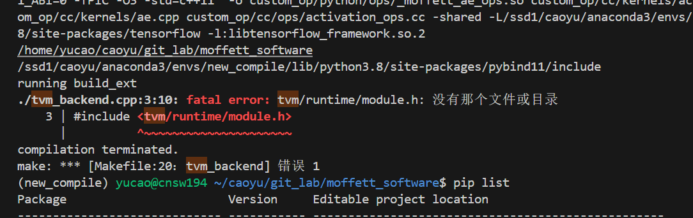
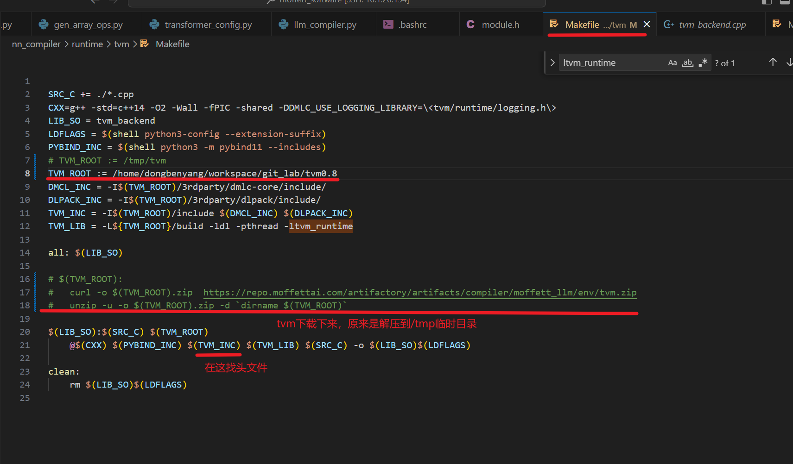
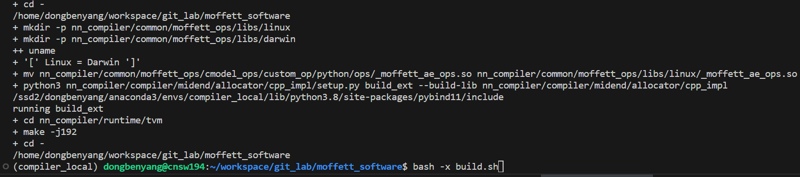
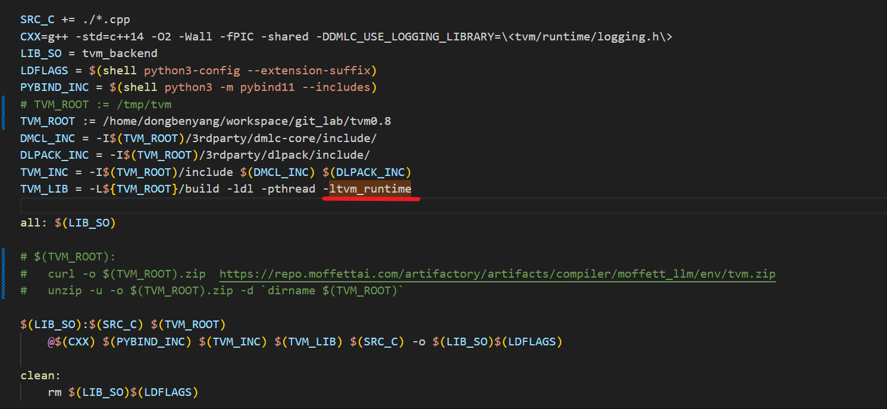

- [x] 1、moffett_software 在build.sh 报错


正确解决方法：

把tvm目录换到自己目录发现执行bash -x [build.sh](http://build.sh/) 没问题，怀疑是/tmp目录被删掉了，最后证实it做了清理



build结果：



检查过程：

1、查找头文件，发现tvm/include/tvm/runtime/module.h文件是有的，但是现在找不到

手动指向头文件目录：

```jsx
export CPLUS_INCLUDE_PATH=$CPLUS_INCLUDE_PATH:/home/dongbenyang/workspace/git_lab/tvm0.8/include

export CPLUS_INCLUDE_PATH=$CPLUS_INCLUDE_PATH:/home/dongbenyang/workspace/git_lab/tvm0.8/3rdparty/dmlc-core/include

export CPLUS_INCLUDE_PATH=$CPLUS_INCLUDE_PATH:/home/dongbenyang/workspace/git_lab/tvm0.8/3rdparty/dlpack/include
```

还是报错，说ltvm_runtime即${TVM_ROOT}/build/libtvm_runtime.so找不到，但明明是有的，最后怀疑被清理掉了




- [x] 2、torch_mlir安装使用
github官网：https://github.com/llvm/torch-mlir
文档：https://github.com/llvm/torch-mlir/blob/main/docs/development.md
    
    1. 下载源码
    ```
    git clone https://github.com/llvm/torch-mlir
    cd torch-mlir
    git submodule update --init --progress
    ```
    2. 创建环境 

    ```
    conda create -n torch-mlir python=3.11
    conda activate torch-mlir
    python -m pip install --upgrade pip
    python -m pip install -r requirements.txt
    python -m pip install -r torchvision-requirements.txt
    ```
    3. (optional) 直接安装编译好的wheel文件
    ```
    pip install --pre torch-mlir torchvision \
  --extra-index-url https://download.pytorch.org/whl/nightly/cpu \
  -f https://github.com/llvm/torch-mlir-release/releases/expanded_assets/dev-wheels
    ```
    4. 源码编译
    ```
    
    ```

cmake -GNinja -Bbuild \
  externals/llvm-project/llvm \
  -DCMAKE_BUILD_TYPE=Debug  \
  -DLLVM_ENABLE_ASSERTIONS=ON \
  -DPython3_FIND_VIRTUALENV=ONLY \
  -DLLVM_ENABLE_PROJECTS=mlir \
  -DLLVM_EXTERNAL_PROJECTS="torch-mlir" \
  -DLLVM_EXTERNAL_TORCH_MLIR_SOURCE_DIR="$PWD" \
  -DMLIR_ENABLE_BINDINGS_PYTHON=ON \
  -DLLVM_TARGETS_TO_BUILD=host \
  `# use clang`\
  -DCMAKE_C_COMPILER=clang -DCMAKE_CXX_COMPILER=clang++ \
  `# use ccache to cache build results` \
  -DCMAKE_C_COMPILER_LAUNCHER=ccache -DCMAKE_CXX_COMPILER_LAUNCHER=ccache \
  `# use LLD to link in seconds, rather than minutes` \
  `# if using clang <= 13, replace --ld-path=ld.lld with -fuse-ld=lld` \
  -DCMAKE_EXE_LINKER_FLAGS_INIT="--ld-path=ld.lld" \
  -DCMAKE_MODULE_LINKER_FLAGS_INIT="--ld-path=ld.lld" \
  -DCMAKE_SHARED_LINKER_FLAGS_INIT="--ld-path=ld.lld" \
  `# Enabling libtorch binary cache instead of downloading the latest libtorch everytime.` \
  `# Testing against a mismatched version of libtorch may cause failures` \
  -DLIBTORCH_CACHE=ON \
  `# Enable an experimental path to build libtorch (and PyTorch wheels) from source,` \
  `# instead of downloading them` \
  -DLIBTORCH_SRC_BUILD=ON \
  `# Set the variant of libtorch to build / link against. (shared|static and optionally cxxabi11)` \
  -DLIBTORCH_VARIANT=shared


cmake -GNinja -Bbuild   -DCMAKE_BUILD_TYPE=Release   -DPython3_FIND_VIRTUALENV=ONLY  -DMLIR_DIR="/home.local/dongbenyang/workspace/workspace_43/project/llvm-project/build"  -DLLVM_DIR="/home.local/dongbenyang/workspace/workspace_43/project/llvm-project/build_llvm"   -DLLVM_ENABLE_PROJECTS=mlir   -DLLVM_EXTERNAL_PROJECTS="torch-mlir"   -DLLVM_EXTERNAL_TORCH_MLIR_SOURCE_DIR="$PWD"   -DMLIR_ENABLE_BINDINGS_PYTHON=ON   -DLLVM_TARGETS_TO_BUILD=host   externals/llvm-project/llvm


搞清楚不同的评测方式差异：


已支持评估指标:https://opencompass.readthedocs.io/zh-cn/latest/user_guides/metrics.html
OpenCompass 中，常用的 Evaluator 主要放在 **opencompass/openicl/icl_evaluator**文件夹下， 还有部分数据集特有指标的放在 **opencompass/datasets** 的部分文件中。


opencompass不同的评测方式：
ppl：
gen：
mixed：
prompts:


core:
medium:
small:
core:


clp:

- [ ]不同的评估方法差异？


eplios 安装
```
git clone git@gitlab.moffett.local:softwareteam/Epsilon.git
```

images_id:
76048cd47521
目录：/ssd1/yucao/cuda_code/Epsilon