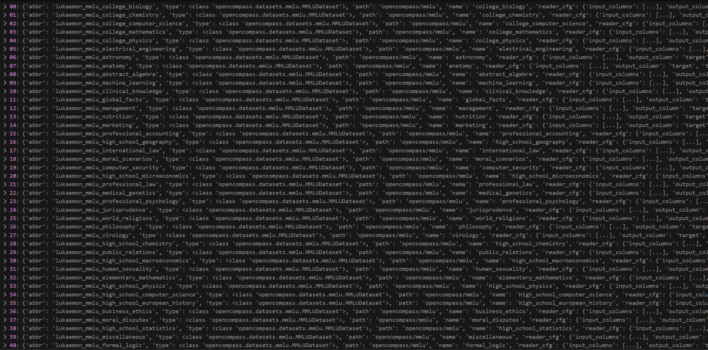
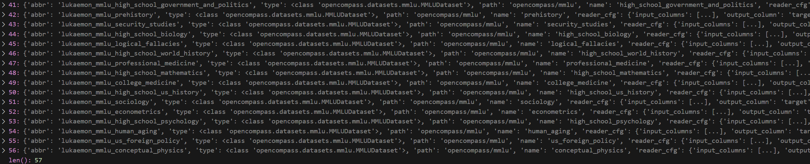

[TOC]

# 1、各模块介绍
主要从models、datasets、metric、mode几个方便介绍
## models
### 1、介绍
官方文档：https://opencompass.readthedocs.io/zh-cn/latest/advanced_guides/new_model.html
已经支持的模型有 HF 模型、部分模型 API 、部分第三方模型。
支持的模型在opencompass/models目录下，HF 模型
#### 1.1、 基于 HuggingFace 的模型
在 OpenCompass 中，我们支持直接从 Huggingface 的 AutoModel.from_pretrained 和 AutoModelForCausalLM.from_pretrained 接口构建评测模型。如果需要评测的模型符合 HuggingFace 模型通常的生成接口， 则不需要编写代码，直接在配置文件中指定相关配置即可。

如下，为一个示例的 HuggingFace 模型配置文件：
```python
# 使用 `HuggingFace` 评测 HuggingFace 中 AutoModel 支持的模型
# 使用 `HuggingFaceCausalLM` 评测 HuggingFace 中 AutoModelForCausalLM 支持的模型
from opencompass.models import HuggingFaceCausalLM

models = [
    dict(
        type=HuggingFaceCausalLM,
        # 以下参数为 `HuggingFaceCausalLM` 的初始化参数
        path='huggyllama/llama-7b',
        tokenizer_path='huggyllama/llama-7b',
        tokenizer_kwargs=dict(padding_side='left', truncation_side='left'),
        max_seq_len=2048,
        batch_padding=False,
        # 以下参数为各类模型都有的参数，非 `HuggingFaceCausalLM` 的初始化参数
        abbr='llama-7b',            # 模型简称，用于结果展示
        max_out_len=100,            # 最长生成 token 数
        batch_size=16,              # 批次大小
        run_cfg=dict(num_gpus=1),   # 运行配置，用于指定资源需求
    )
]
```
#### 1.2、基于 API 的模型
OpenCompass 目前支持以下基于 API 的模型推理：

- OpenAI（opencompass.models.OpenAI）

- ChatGLM@智谱清言 (opencompass.models.ZhiPuAI)

- ABAB-Chat@MiniMax (opencompass.models.MiniMax)

- XunFei@科大讯飞 (opencompass.models.XunFei)
以下，我们以 OpenAI 的配置文件为例，模型如何在配置文件中使用基于 API 的模型。
```python
from opencompass.models import OpenAI

models = [
    dict(
        type=OpenAI,                             # 使用 OpenAI 模型
        # 以下为 `OpenAI` 初始化参数
        path='gpt-4',                            # 指定模型类型
        key='YOUR_OPENAI_KEY',                   # OpenAI API Key
        max_seq_len=2048,                        # 最大输入长度
        # 以下参数为各类模型都有的参数，非 `OpenAI` 的初始化参数
        abbr='GPT-4',                            # 模型简称
        run_cfg=dict(num_gpus=0),                # 资源需求（不需要 GPU）
        max_out_len=512,                         # 最长生成长度
        batch_size=1,                            # 批次大小
    ),
]
```
我们也提供了API模型的评测示例，请参考
configs
├── eval_zhipu.py
├── eval_xunfei.py
└── eval_minimax.py

#### 1.3、自定义模型
如果以上方式无法支持你的模型评测需求，请参考 [新增评测模型](./3、新增评测模型.md) 在 OpenCompass 中增添新的模型支持。

### 2、配置
官方文档：https://opencompass.readthedocs.io/zh-cn/latest/user_guides/models.html

## datasets 介绍 及 配置
官方文档：https://opencompass.readthedocs.io/zh-cn/latest/user_guides/datasets.html
目录结构：
configs/datasets/
├── agieval
├── apps
├── ARC_c
├── ...
├── CLUE_afqmc  # 数据集
│   ├── CLUE_afqmc_gen_901306.py  # 不同版本数据集配置文件
│   ├── CLUE_afqmc_gen.py
│   ├── CLUE_afqmc_ppl_378c5b.py
│   ├── CLUE_afqmc_ppl_6507d7.py
│   ├── CLUE_afqmc_ppl_7b0c1e.py
│   └── CLUE_afqmc_ppl.py
├── ...
├── XLSum
├── Xsum
└── z_bench
configs/datasets目录结构下，有多个数据集配置，每个数据集目录下面，存在多个数据集配置文件，数据集配置文件名由以下命名方式构成 {数据集名称}_{评测方式}_{prompt版本号}.py
mmlu/mmlu_gen_4d595a.py为例：
    - 数据集：mmlu
    - 评测方法：gen
    - prompt版本号：4d595a
除此之外，不带版本号的文件，例如： mmlu_gen.py 则指向该评测方式最新的prompt配置文件，通常来说会是精度最高的prompt。

数据集选择：
在各个数据集配置文件中，数据集将会被定义在 {}_datasets 变量当中，例如下面 mmlu/mmlu_gen_4d595a.py 中的 mmlu_datasets。
```
mmlu_datasets.append(
        dict(
            abbr=f'lukaemon_mmlu_{_name}',
            type=MMLUDataset,
            path='opencompass/mmlu',
            name=_name,
            reader_cfg=mmlu_reader_cfg,
            infer_cfg=mmlu_infer_cfg,
            eval_cfg=mmlu_eval_cfg,
        ))
```
配置文件中数据集选择:
如果用户想同时评测这两个数据集，可以在 configs 目录下新建一个配置文件，我们使用 mmengine 配置中直接import的机制来构建数据集部分的参数，如下所示：
```python
from mmengine.config import read_base

with read_base():
    from .datasets.CLUE_afqmc.CLUE_afqmc_gen_db509b import afqmc_datasets
    from .datasets.CLUE_cmnli.CLUE_cmnli_ppl_b78ad4 import cmnli_datasets

datasets = []
datasets += afqmc_datasets
datasets += cmnli_datasets
```

mmlu数据集介绍,以lukaemon_mmlu_college_biology为例：
1. abbr：lukaemon_mmlu_college_biology
2. type：<class 'opencompass.datasets.mmlu.MMLUDataset'>
3. path：opencompass/mmlu
4. name：college_biology
5. reader_cfg： 
    - input_columns:
        - input
        - A
        - B 
        - C 
        - D
    - output_column：target
    - train_split：dev
6. infer_cfg：
    - ice_template：
        - type：<class 'opencompass.openicl.icl_prompt_template.PromptTemplate'>
        - template
            - round：[{'role': 'HUMAN', 'prompt': 'There is a single choice question about college biology. Answer the question by replying A, B, C or D.\nQuestion: {input}\nA. {A}\nB. {B}\nC. {C}\nD. {D}\nAnswer: '}, {'role': 'BOT', 'prompt': '{target}\n'}]
    - prompt_template： 
        - type：<class 'opencompass.openicl.icl_prompt_template.PromptTemplate'>
        - template：
            - begin：</E>
            - round：[{'role': 'HUMAN', 'prompt': 'There is a single choice question about college biology. Answer the question by replying A, B, C or D.\nQuestion: {input}\nA. {A}\nB. {B}\nC. {C}\nD. {D}\nAnswer: '}]
        - ice_token：</E>
    - retriever：
        - type：<class 'opencompass.openicl.icl_retriever.icl_fix_k_retriever.FixKRetriever'
        - fix_id_list：[0, 1, 2, 3, 4]
    - inferencer：
        - type：<class 'opencompass.openicl.icl_inferencer.icl_gen_inferencer.GenInferencer'>
7. eval_cfg：
    - evaluator
        - type：AccwithDetailsEvaluator
    - pred_postprocessor
        - type：first_option_postprocess
        - options：ABCD

总共57个




summarizer：
/home.local/dongbenyang/workspace/workspace_43/project/opencompass/configs/summarizers/leaderboard.py
Overall
1. Exam(考试)
    - Mixed(subcategory)
        - ceval
        - agieval
        - mmlu
        - cmmlu
        - GaokaoBench
        - ARC-c
        - ARC-e
2. Language(语言)
    - 字词释义(subcategory)
        - WiC
    - 成语习语(subcategory)
        - chid-dev
    - 语义相似度(subcategory)
        - afqmc-dev
    - 指代消解(subcategory)
        - WSC
    - 多语种问答(subcategory)
        - tydiqa-goldp
    - 翻译(subcategory)
        - flores_100
3. Knowledge(知识)
    - 知识问答(subcategory)
        - BoolQ
        - commonsense_qa
        - triviaqa
        - nq
4. Understanding(理解)
    - 阅读理解(subcategory)
        - C3
        - race-middle
        - race-high
        - openbookqa_fact
    - 内容总结(subcategory)
        - csl_dev
        - lcsts
        - Xsum
    - 内容分析(subcategory)
        - eprstmt-dev
        - lambada
5. Reasoning(推理)
    - 文本蕴含(subcategory)
        - cmnli
        - ocnli
        - AX_b
        - AX_g
        - RTE
    - 常识推理(subcategory)
        - COPA
        - ReCoRD
        - hellaswag
        - piqa
        - siqa
    - 数学推理(subcategory)
        - math
        - gsm8k
    - 定理应用(subcategory)
    - 阅读理解(subcategory)
        - drop
    - 代码(subcategory)
        - openai_humaneval
        - mbpp
    - 综合推理(subcategory)
        - bbh

一个数据集可能包含多个小类别，每个类别的权重占比不同
/home.local/dongbenyang/workspace/workspace_43/project/opencompass/configs/summarizers/groups/mmlu.py
```
_mmlu_weights = {'college_biology': 144,'college_chemistry': 100,……,'conceptual_physics': 235}
```

```python
from opencompass.openicl.icl_inferencer import GenInferencer
```

## metric (评估指标)
官方文档：https://opencompass.readthedocs.io/zh-cn/latest/user_guides/metrics.html
### 1、简介
在评测阶段，我们一般以数据集本身的特性来选取对应的评估策略，最主要的依据为标准答案的类型，一般以下几种类型：
- 选项：常见于分类任务，判断题以及选择题，目前这类问题的数据集占比最大，有 MMLU, CEval 数据集等等，评估标准一般使用准确率–ACCEvaluator。

- 短语：常见于问答以及阅读理解任务，这类数据集主要包括 CLUE_CMRC, CLUE_DRCD, DROP 数据集等等，评估标准一般使用匹配率–EMEvaluator。

- 句子：常见于翻译以及生成伪代码、命令行任务中，主要包括 Flores, Summscreen, Govrepcrs, Iwdlt2017 数据集等等，评估标准一般使用 BLEU(Bilingual Evaluation Understudy)–BleuEvaluator。

- 段落：常见于文本摘要生成的任务，常用的数据集主要包括 Lcsts, TruthfulQA, Xsum 数据集等等，评估标准一般使用 ROUGE（Recall-Oriented Understudy for Gisting Evaluation）–RougeEvaluator。

- 代码：常见于代码生成的任务，常用的数据集主要包括 Humaneval，MBPP 数据集等等，评估标准一般使用执行通过率以及 pass@k，目前 Opencompass 支持的有MBPPEvaluator、HumanEvalEvaluator。

还有一类打分类型评测任务没有标准答案，比如评判一个模型的输出是否存在有毒，可以直接使用相关 API 服务进行打分，目前支持的有 ToxicEvaluator，目前有 realtoxicityprompts 数据集使用此评测方式。
### 2、指标分类
OpenCompass常用的 Evaluator 主要放在 **opencompass/openicl/icl_evaluator**文件夹下， 还有部分数据集特有指标的放在 **opencompass/datasets** 的部分文件中。以下是汇总：
|评估指标 | 评估策略 | 常用后处理方式 | 数据集
| ----------- | ----------- | ----------- | ----------- |
|ACCEvaluator|正确率|first_capital_postprocess|agieval, ARC, bbh, mmlu, ceval, commonsenseqa, crowspairs, hellaswag|
|EMEvaluator|匹配率|None, dataset_specification|	drop, CLUE_CMRC, CLUE_DRCD|
|BleuEvaluator|BLEU|None, flores|flores, iwslt2017, summscreen, govrepcrs|
|RougeEvaluator|ROUGE|None, dataset_specification|	truthfulqa, Xsum, XLSum|
|JiebaRougeEvaluator|ROUGE|None, dataset_specification|	lcsts|
|HumanEvalEvaluator|pass@k|humaneval_postprocess|	humaneval_postprocess|
|MBPPEvaluator|执行通过率|None|mbpp|
|ToxicEvaluator|PerspectiveAPI|None|realtoxicityprompts|
|AGIEvalEvaluator|正确率|None|agieval|
AUCROCEvaluator|AUC-ROC|None|jigsawmultilingual, civilcomments|
|MATHEvaluator|正确率|math_postprocess|math|
|MccEvaluator|Matthews Correlation|None|–|
|SquadEvaluator|F1-scores|None|–|


- mmlu数据集，Evaluator 在opencompass/openicl/icl_evaluator，因为mmlu是选择题，所以是严格的acc(naive_average)，predictions和references 相等数量/总的问题数量占比
```python
from opencompass.openicl.icl_evaluator import AccwithDetailsEvaluator
mmlu_eval_cfg = dict(
        evaluator=dict(type=AccwithDetailsEvaluator),
        pred_postprocessor=dict(type=first_option_postprocess, options='ABCD'))
```

- gsm8k数据集，Evaluator 在opencompass/datasets里面，数据集主要是问题和答案，gsm8k_postprocess会拿到anser的最后一个数字。是宽松的acc(相等就或者绝对值小于1e-6)(accuracy)，predictions和references 相等数量/总的问题数量占比
opencompass/opencompass/datasets/gsm8k.py
```python
from opencompass.datasets import GSM8KDataset, gsm8k_postprocess, gsm8k_dataset_postprocess, Gsm8kEvaluator

gsm8k_eval_cfg = dict(evaluator=dict(type=Gsm8kEvaluator),
                      pred_postprocessor=dict(type=gsm8k_postprocess),
                      dataset_postprocessor=dict(type=gsm8k_dataset_postprocess))
```
gsm8k_postprocess会拿到anser的最后一个数
```
"question": "Josh decides to try flipping a house.  He buys a house for $80,000 and then puts in $50,000 in repairs.  This increased the value of the house by 150%.  How much profit did he make?", "answer": "The cost of the house and repairs came out to 80,000+50,000=$<<80000+50000=130000>>130,000\nHe increased the value of the house by 80,000*1.5=<<80000*1.5=120000>>120,000\nSo the new value of the house is 120,000+80,000=$<<120000+80000=200000>>200,000\nSo he made a profit of 200,000-130,000=$<<200000-130000=70000>>70,000\n#### 70000"}
```
### 3、配置
评估标准配置一般放在数据集配置文件中，最终的 xxdataset_eval_cfg 会传给 dataset.infer_cfg 作为实例化的一个参数。

下面是 govrepcrs_eval_cfg 的定义， 具体可查看 configs/datasets/govrepcrs。
```python
from opencompass.openicl.icl_evaluator import BleuEvaluator
from opencompass.datasets import GovRepcrsDataset
from opencompass.utils.text_postprocessors import general_cn_postprocess

govrepcrs_reader_cfg = dict(.......)
govrepcrs_infer_cfg = dict(.......)

# 评估指标的配置
govrepcrs_eval_cfg = dict(
    evaluator=dict(type=BleuEvaluator),            # 使用常用翻译的评估器BleuEvaluator
    pred_role='BOT',                               # 接受'BOT' 角色的输出
    pred_postprocessor=dict(type=general_cn_postprocess),      # 预测结果的后处理
    dataset_postprocessor=dict(type=general_cn_postprocess))   # 数据集标准答案的后处理

govrepcrs_datasets = [
    dict(
        type=GovRepcrsDataset,                 # 数据集类名
        path='./data/govrep/',                 # 数据集路径
        abbr='GovRepcrs',                      # 数据集别名
        reader_cfg=govrepcrs_reader_cfg,       # 数据集读取配置文件，配置其读取的split，列等
        infer_cfg=govrepcrs_infer_cfg,         # 数据集推理的配置文件，主要 prompt 相关
        eval_cfg=govrepcrs_eval_cfg)           # 数据集结果的评估配置文件，评估标准以及前后处理。
]
```

## mode
### 1、介绍
opencompass/opencompass/openicl/icl_inferencer
推理方式配置,
- PPLInferencer 使用 PPL（困惑度）获取答案:ppl
- GenInferencer 使用模型的生成结果获取答案:gen

### 2、分类
opencompass/opencompass/openicl/icl_inferencer/__init__.py
|prompt 方式|path|
| ----------- | ----------- |
|AgentInferencer|from .icl_agent_inferencer import AgentInferencer|
|AttackInferencer|from .icl_attack_inferencer import AttackInferencer|
|BaseInferencer|from .icl_base_inferencer import BaseInferencer|
|ChatInferencer|from .icl_chat_inferencer import ChatInferencer|
|CLPInferencer|from .icl_clp_inferencer import CLPInferencer|
|GenInferencer|from .icl_gen_inferencer import GenInferencer|
|InferencePPLOnlyInferencer|from .icl_inference_ppl_only_inferencer import InferencePPLOnlyInferencer|
|LLInferencer|from .icl_ll_inferencer import LLInferencer|
|MinKPercentInferencer|from .icl_mink_percent_inferencer import MinKPercentInferencer|
|PPLInferencer|from .icl_ppl_inferencer import PPLInferencer|
|PPLOnlyInferencer|from .icl_ppl_only_inferencer import PPLOnlyInferencer|
|SCInferencer|from .icl_sc_inferencer import SCInferencer|
|SWCELossInferencer|from .icl_sw_ce_loss_inferencer import SWCELossInferencer|
|ToTInferencer|from .icl_tot_inferencer import ToTInferencer|

### 3、配置
```python
from opencompass.openicl.icl_inferencer import GenInferencer
mmlu_infer_cfg = dict(
        ice_template=dict(
            type=PromptTemplate,
            template=dict(round=[
                dict(
                    role='HUMAN',
                    prompt=
                    f'{_hint}\nQuestion: {{input}}\nA. {{A}}\nB. {{B}}\nC. {{C}}\nD. {{D}}\nAnswer: '
                ),
                dict(role='BOT', prompt='{target}\n')
            ]),
        ),
        prompt_template=dict(
            type=PromptTemplate,
            template=dict(
                begin='</E>',
                round=[
                    dict(
                        role='HUMAN',
                        prompt=f'{_hint}\nQuestion: {{input}}\nA. {{A}}\nB. {{B}}\nC. {{C}}\nD. {{D}}\nAnswer: '
                    ),
                ],
            ),
            ice_token='</E>',
        ),
        retriever=dict(type=FixKRetriever, fix_id_list=[0, 1, 2, 3, 4]),
        inferencer=dict(type=GenInferencer),
    )
```

# 2、执行流程 和 注册机制


# 3、生成报告
生成报告目录结构如下：
outputs/default/
├── 20231127_160345
├── ...
├── 20231129_112843   # 每次评测，以日期前缀命名
│   ├── configs       # 每次实验都会在此处存下用于追溯的 config
│   ├── logs          # 运行日志
│   │   ├── eval
│   │   └── infer
│   ├── predictions   # 储存了每个任务的推理结果
│   ├── results       # 每个数据集不同类别的评测结果
│   └── summary       # 评测结果
│   │   ├── summary_20231129_112843.csv
│   │   └── summary_20231129_112843.txt
├── ...


- predictions:储存了每个任务的推理结果
opencompass/outputs/default/outputs/20241016/predictions/ChatGLM-6B_bidirectional_mask/lukaemon_mmlu_abstract_algebra.json
```
"0": {
        "origin_prompt": "There is a single choice question about abstract algebra. Answer the question by replying A, B, C or D.\nQuestion: Find all c in Z_3 such that Z_3[x]/(x^2 + c) is a field.\nA. 0\nB. 1\nC. 2\nD. 3\nAnswer: \nB\n\nThere is a single choice question about abstract algebra. Answer the question by replying A, B, C or D.\nQuestion: Statement 1 | If aH is an element of a factor group, then |aH| divides |a|. Statement 2 | If H and K are subgroups of G then HK is a subgroup of G.\nA. True, True\nB. False, False\nC. True, False\nD. False, True\nAnswer: \nB\n\nThere is a single choice question about abstract algebra. Answer the question by replying A, B, C or D.\nQuestion: Statement 1 | Every element of a group generates a cyclic subgroup of the group. Statement 2 | The symmetric group S_10 has 10 elements.\nA. True, True\nB. False, False\nC. True, False\nD. False, True\nAnswer: \nC\n\nThere is a single choice question about abstract algebra. Answer the question by replying A, B, C or D.\nQuestion: Statement 1| Every function from a finite set onto itself must be one to one. Statement 2 | Every subgroup of an abelian group is abelian.\nA. True, True\nB. False, False\nC. True, False\nD. False, True\nAnswer: \nA\n\nThere is a single choice question about abstract algebra. Answer the question by replying A, B, C or D.\nQuestion: Find the characteristic of the ring 2Z.\nA. 0\nB. 3\nC. 12\nD. 30\nAnswer: \nA\n\nThere is a single choice question about abstract algebra. Answer the question by replying A, B, C or D.\nQuestion: Find the degree for the given field extension Q(sqrt(2), sqrt(3), sqrt(18)) over Q.\nA. 0\nB. 4\nC. 2\nD. 6\nAnswer: ",
        "prediction": "\nC",
        "gold": "B"
    },
```

- results:每个数据集不同类别的评测结果
opencompass/outputs/default/outputs/20241016/results/ChatGLM-6B_bidirectional_mask/lukaemon_mmlu_abstract_algebra.json
```
{
    "accuracy": 21.0
}
```

- summary: 模型在不同场景、场景下不同数据集、不同评估方法 下的 评测结果汇总

| dataset | version | metric | mode | model_name |
| -----------| ----------- | ----------- | ----------- | ----------- |
| Overall | - | - | - | - |
| Exam | - | - | - | - |
| Language | - | - | - | - |
| Knowledge | - | - | - | - |
| Understanding | - | - | - | - |
| Reasoning | - | - | - | - |

